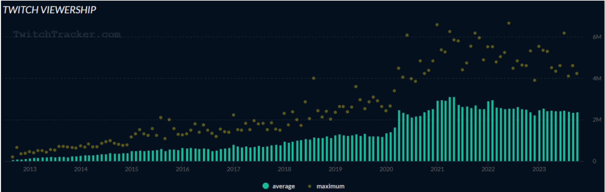
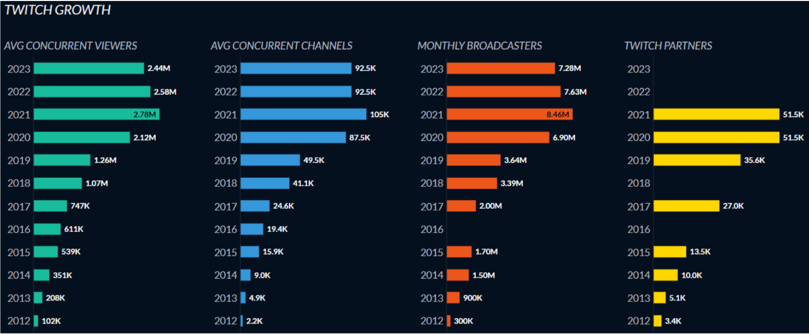

## Arquitetura de Software

- Grupo: Bruno Gomes, João Mairinque, Matheus Andrade, Matheus Vieira e Samara Martins.
- Sistema: Twitch.
- Motivação: Mudança de arquitetura.

### *Apresentação do sistema:*

    Twitch é uma plataforma de transmissão de vídeo ao vivo que se destaca principalmente pelo streaming de jogos. Neste ambiente, os utilizadores têm a oportunidade de interagir uns com os outros, tanto através de um chat disponível como através das transmissões de vídeo e áudio. O sistema foi lançado em junho de 2011 com uma arquitetura monolítica desenvolvida com Ruby on Rails. Entretanto, a base de usuários do Twitch começou a crescer rapidamente, chegando a cerca de 20.000 usuários no mesmo ano do lançamento, o que naquele período era considerado um número elevado. Com esse aumento, problemas como gargalo de desempenho começaram a surgir, onde, partes do sistema começaram a atingir seus limites, prejudicando seu funcionamento como um todo.
    Atualmente a twitch alcança média superior a 2 milhões de viewers simultâneos por mês, e teve seu pico máximo de 6.6 milhões em 24 de Junho de 2022. Além disso, conta com a média superior a 80 mil canais ao vivo simultaneamente, com o pico de 233 mil em 30 de novembro de 2020. A Figura 01 abaixo apresenta o gráfico de viewers, demonstrando a média e os picos durante os anos.

Figura 01: Gráfico com as médias e picos de viewers durante os anos.

    A twitch abrange alguns tipos de usuários como os viewers, canais, broadcasters e parceiros. O crescimento da plataforma em relação aos tipos de usuários durante os anos estão apresentados na Figura 02 abaixo.

Figura 02: Gráficos em barras demonstrando a relação de crescimento dos usuários na plataforma entre os anos de 2012 a 2023

*Referências
https://twitchtracker.com/statistics
https://blog.twitch.tv/en/2023/09/28/twitch-state-of-engineering-2023/*
