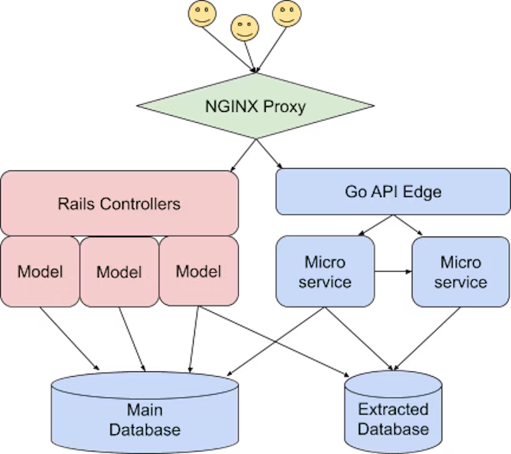
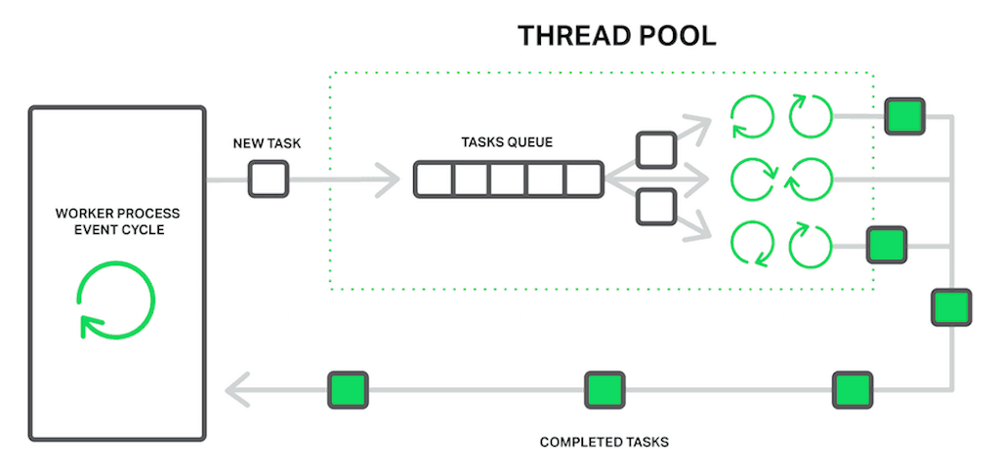
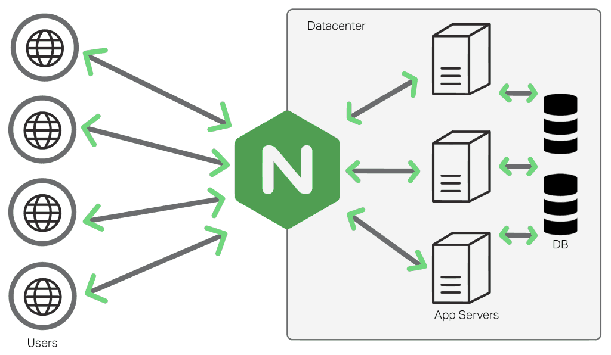

# Arquitetura de Software

## Analisando Arquiteturas de Sistemas de Software Populares

- Grupo: Bruno Gomes, João Mairinque, Matheus Andrade, Matheus Vieira e Samara Martins.
- Sistema: Twitch.
- Motivação: Mudança de arquitetura.

### *Apresentação do sistema*

Twitch é uma plataforma de transmissão de vídeo ao vivo lançada em junho de 2011, que se destaca principalmente pelo streaming de jogos. Neste ambiente, os utilizadores têm a oportunidade de interagir uns com os outros, tanto através de um chat disponível como através das transmissões de vídeo e áudio. 

### *Informações arquiteturais*
Inicialmente o sistema foi desenvolvido como uma arquitetura monolítica desenvolvida com Ruby on Rails. Entretanto, a base de usuários do Twitch começou a crescer rapidamente, chegando a cerca de 20.000 usuários no mesmo ano do lançamento, o que naquele período era considerado um número elevado. Com esse aumento, problemas como gargalo de desempenho começaram a surgir, onde, partes do sistema começaram a atingir seus limites, prejudicando seu funcionamento como um todo. Por esse motivo, os criadoress da aplicação começaram a discutir uma possível mudança de arquitetura, passando a utilizar microsserviços. A mudança para microserviços incluiu a adição de novas liguagens como Go, Typescript, C++ e migração do Rails para o React.js. Essas tecnologias foram implementadas visando otimização do novo modelo de arquitetura a fim de resolver o problema de escalabilidade.

### *Dados de usuários e escala*
Atualmente a twitch alcança média superior a 2 milhões de viewers simultâneos por mês, e teve seu pico máximo de 6.6 milhões em 24 de Junho de 2022. Além disso, conta com a média superior a 80 mil canais ao vivo simultaneamente, com o pico de 233 mil em 30 de novembro de 2020. A Figura 01 abaixo apresenta o gráfico de viewers, demonstrando a média e os picos durante os anos.

Figura 01: Gráfico com as médias e picos de viewers durante os anos.

A twitch abrange alguns tipos de usuários como os viewers, canais, broadcasters e parceiros. O crescimento da plataforma em relação aos tipos de usuários durante os anos estão apresentados na Figura 02 abaixo.

Figura 02: Gráficos em barras demonstrando a relação de crescimento dos usuários na plataforma entre os anos de 2012 a 2023

### *Arquitetura de software*
A arquitetura em monolito acarretava em várias dificuldades para os desenvolvedores, como o uso de uma única pipeline deploy para todos, dificuldade de coordenação do ambiente de testes, lentidão na requisição no banco de dados, rastreamento lento devido ao grande volume de endpoints da API. O modelo até então desenvolvido em Ruby era caracterizado como uma “spaghetti architecture”. A transição para a arquitetura de microsserviços implementada principalmente em Go teve seu início e principal esforço a adição de uma camada extra mais externa da API backend, um proxy reverso chamado NGINX. O NGINX tem como função direcionar parte do tráfego para uma nova parte da borda da API, que utiliza um middleware comum para validação, autorização e limitação de taxa; mas delega toda a lógica de negócios aos microsserviços subjacentes.

Com a resolução da implementação do proxy foi definido um processo de migração dos endpoints:
- Desenvolver novo conjunto de microsserviços;
- Replicar os antigos endpoints na nova borda;
- Atualizar a configuração do NGINX para direcionar o percentual de tráfego para os novos endpoints; 
- Verificar as métricas e incrementar o tráfego de dados até os 100%.

Com os desenvolvedores implementando novas funcionalidades no novo modelo, a arquitetura monolítica passou a ficar muito obsoleta. Foi necessário uma adaptação da equipe para o novo modelo de implementação, que levou de 2016 a 2018, com os desenvolvedores aprendendo como prover os recursos da AWS e adaptando-se ao Go.
O modelo de microsserviços é muito mais complexo que o modelo monolítico. Enquanto no último a chamada de um módulo é o equivalente a chamar uma função ou método, no primeiro a chamada de um serviço demanda muito mais: tratamento de erro, monitoramento, versão de API, entre outros.

No que diz respeito à carga de trabalho, a migração dos endpoints foi o processo mais difícil e demorado apesar de ser a menor parte da transição da arquitetura, seguindo a regra de “pareto”, onde os últimos 20% do trabalho levam 80% do tempo. A dificuldade estava relacionada com segurança e qualidade de código, tendo em vista que atendiam às regras de negócio. Os endpoints mantinham tráfego de recursos desconhecidos, talvez bots ou scripts. 

Quando em 2018 quando o tráfego foi desvinculado no modelo monolítico, todas as instâncias EC2 da conta principal da AWS foram interrompidas. Levando mais um ano para a limpeza de dependências da conta e dos pontos de acesso. 
Atualmente todo o ambiente de microsserviço é isolado em sua própria conta AWS. Times de produtos distintos podem operar independentemente, gerenciando sua própria infraestrutura e ajustando os serviços conforme necessário.

### *Impacto Organizacional*
Segundo a lei de Conway, as estruturas de um sistema de software tendem a ‘’espelhar’’ a estrutura da organização que o desenvolvem, sendo assim, uma empresa que opta por fazer uma transição para um sistema de microsserviços, naturalmente passa por diversas turbulências até finalmente criar times especializados mas que consigam se comunicar bem, assim como um microsserviço. 

Essa tendência também ocorreu na Twitch, onde o crescimento desenfreado da plataforma acabou adicionando uma camada de dificuldade nas migrações que estavam ocorrendo na plataforma. De acordo com o autor do artigo, em 2017 houve um caso onde uma nova versão do Twitch mobile causou um número exagerado de requisições na API, o que aconteceu foi que ambos os times haviam testado suas versões de forma isolada mas não haviam feito um teste de integração entre a versão mobile e a API.

Como uma tentativa de evitar pontos cegos como os citados, as companhias tendem a fazer as chamadas ‘’reorgs’’, que é basicamente uma ação onde os engenheiros de software reavaliam as migrações que estão ocorrendo no momento, reveem quais serviços de fato de fato precisam ser divididos, atualizam permissões de acesso caso necessário e propõem refatorações de código. Esses pontos cegos são praticamente inevitáveis, mas podem ser diminuídos quando se utilizam desse tipo de estratégia.  

Apesar das migrações para o microsserviços terem sido árduas e cheias de desafios, o time de desenvolvedores e engenheiros da Twitch conseguiu chegar em um patamar onde a maioria dos times possuem vários serviços onde cada ambiente é isolado em uma conta separada da AWS. É dito pelo autor do artigo que as migrações na plataforma da Twitch continuam acontecendo conforme novas tecnologias vão surgindo, mas a situação atual da empresa permite que um time consiga implementar essas tecnologias sem que afete os outros times.  

### *Tecnologias utilizadas*

A arquitetura da Twitch envolve diversos componentes e tecnologias, destacando a complexidade e a escalabilidade dos sistemas necessários para suportar um serviço de streaming ao vivo e de alto desempenho. As principais tecnologias utilizadas no projeto foram Ruby, Go, VOD, Computação de borda e React.js.

 - Ruby: O Twitch originalmente utilizava Ruby on Rails, uma escolha comum para startups devido à sua rapidez no desenvolvimento e facilidade de uso. A abordagem monolítica com Ruby on Rails permitiu ao Twitch lançar rapidamente e iterar de maneira eficiente, algo crítico para startups em estágio inicial. Conforme o Twitch cresceu, a arquitetura monolítica começou a apresentar desafios em termos de coordenação, resiliência e escalabilidade. Isto levou à necessidade de dividir o código em partes menores, ou microsserviços​.

 - Go: Em 2012, Go estava ganhando popularidade e havia alcançado um nível de maturidade com o lançamento do Go 1.0, a premissa de ser uma linguagem eficiente e simples chamou a atenção dos desenvolvedores da Twitch, que quando começaram a implementar a mesma até mesmo conseguiram solucionar bugs no chat que até então não eram tão triviais de se resolver. Um dos benefícios chave de utilizar Go na implementação do backend da Twitch, é porque essa linguagem tem suporte para concorrência (possibilidade das funções serem executadas de forma independente), isso permite que a Twitch consiga lidar com múltiplas streams e chats de forma simultânea. Isso significa que o usuário terá uma boa experiência independente da quantidade de usuários utilizando a plataforma ao mesmo tempo. 

 - VOD: O sistema de Vídeo sob Demanda (VOD) do Twitch é uma parte essencial da plataforma, permitindo que os usuários acessem conteúdo de vídeo gravado. O sistema VOD do Twitch arquiva transmissões ao vivo para que os espectadores possam assistir quando quiserem. Isso inclui transmissões de jogos, eventos e outros conteúdos. O VOD é crucial para usuários que não podem assistir às transmissões ao vivo ou desejam revisitar seus momentos favoritos.

 - Computação de borda: A "distribuição e borda" no contexto do Twitch se refere à forma como o serviço de streaming distribui conteúdo de vídeo para os usuários. Depois que o vídeo é transcodificado em múltiplos fluxos HLS (HTTP Live Streaming), ele é distribuído para pontos de presença (POPs) geograficamente dispersos. Esta abordagem garante que os usuários tenham a melhor experiência de streaming de vídeo possível, com alta qualidade e baixa latência. Esses componentes são cruciais para manter o alto desempenho e a escalabilidade do Twitch, garantindo que os usuários em todo o mundo tenham uma experiência de visualização consistente e de alta qualidade.

 - React.js: React.js é conhecido por sua eficiência na criação de interfaces de usuário interativas e dinâmicas. Ele permite a construção de componentes reutilizáveis, o que é ideal para um serviço complexo e multifacetado como o Twitch. A transição para o React.js provavelmente visava oferecer uma experiência de usuário mais fluida e responsiva, especialmente importante para uma plataforma de streaming ao vivo com interações em tempo real. Essa escolha mostra o compromisso do Twitch em adaptar sua tecnologia para melhorar continuamente a experiência do usuário, mantendo-se ágil e responsivo às mudanças nas demandas do mercado e tecnologia.

 - Pub/Sub (Publish/Subscriber): No sistema de chat, o Twitch utiliza o padrão pub/sub para a distribuição eficiente de mensagens entre usuários​​.

 - Cliente-Servidor: Empregado na interação entre as aplicações cliente (web, mobile, console) e os servidores do Twitch, facilitando a comunicação e a entrega de conteúdo​​.

### *NGINX*
		
O NGINX é um servidor web open source, de alta performance. Utiliza uma arquitetura avançada baseada em eventos — Event-based Architecture (EBA). Característica que permite inúmeras conexões simultâneas, proporcionando mais velocidade e escalabilidade. 

O NGINX entrega o conteúdo estático do site de forma rápida, é fácil de configurar e tem baixo consumo de recursos. Por conta de todas essas características, o servidor é utilizado por grandes empresas como Microsoft, IBM, Google, WordPress.org, entre outras.

#### *Como o NGINX  funciona?*

 O NGINX funciona com base em eventos. Assim, em vez de fazer uma solicitação direta ao servidor, ele executa um processo mestre, chamado worker, e vários processos de trabalho, chamados conexões worker. Todo esse processo trabalha continuamente e de forma assíncrona. Quando há um pedido de processamento, ele é feito pelas conexões worker, que fazem a solicitação ao processo mestre que, por sua vez, processa e retorna o resultado.

 Quando o servidor está operando, cada worker carrega uma cadeia de módulos, dependendo de como a configuração é feita durante a instalação. Dessa forma, cada solicitação é feita com todos os recursos configurados em operação.

 

#### *Quais são as características do NGINX?*
 O NGINX conta com uma arquitetura modular extensível, o que facilita a extensão dos recursos para quem quiser mexer em seu código fonte. O módulo principal é responsável por fazer o tratamento da conexão e, além dele, existe uma série de módulos para diferentes tipos de processamento. 

 - Balanceamento de carga: quando há um acréscimo nas solicitações ao servidor, como o aumento do tráfego, o NGINX consegue direcionar o fluxo para outros servidores que estejam no arquivo de configuração.
 - Proxy reverso: o proxy reverso é um servidor web que recebe as solicitações de conexão e gerencia o que será preciso requisitar no servidor principal ou verifica se a solicitação já está disponível em cache. 

 

 - Streaming: oferece um módulo nativo para streaming. Permitindo uma série de configurações sobre como o servidor tratará conteúdos MP4 e FLV, como o tamanho do buffer utilizado, o tempo de timeout, etc.

#### *Por que usar o servidor web NGINX?*

 - Velocidade: a arquitetura baseada em eventos, faz com que as requisições ao servidor sejam feitas com mais rapidez, devido ao melhor aproveitamento de memória e recursos de CPU.
 - Escalabilidade: oferece recursos como o balanceamento de cargas, permitindo o escalonamento rápido das requisições em situações diversas.
 - Compatibilidade: o servidor é sua compatibilidade com os diversos aplicativos web utilizados no mercado, como WordPress, Joomla, Python, entre outros
 - Fácil configuração: a configuração do servidor é simples, pois funciona com base em diretivas que devem ser especificadas no arquivo de configuração.
 

#

### *Referências*

 Twitch Tracker. Estatísticas. Disponível em: https://twitchtracker.com/statistics. Acesso em: 10/11/2023

Twitch. Estado de Engenharia 2023. Disponível em: https://blog.twitch.tv/en/2023/09/28/twitch-state-of-engineering-2023/. Acesso em: 10/11/2023

Twitch. Quebrando o Monólito no Twitch - Parte 2. Disponível em: https://blog.twitch.tv/en/2022/04/12/breaking-the-monolith-at-twitch-part-2/. Acesso em: 10/11/2023

InfoQ. Twitch Plays Pokémon: A Arquitetura de Chat da Twitch. Disponível em: https://pt.slideshare.net/InfoQ/twitch-plays-pokmon-twitchs-chat-architecture. Acesso em: 10/11/2023

O que é NGINX, como funciona e por que você deve usá-lo. Disponível em: https://rockcontent.com/br/blog/nginx/

